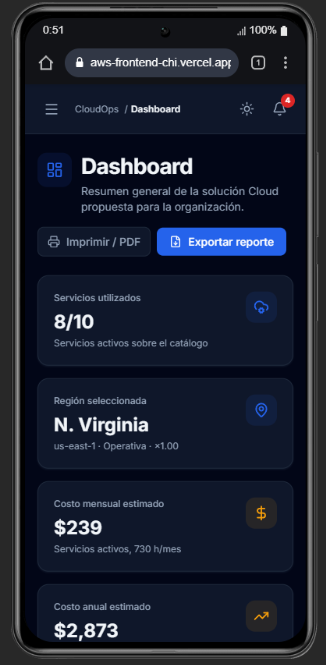
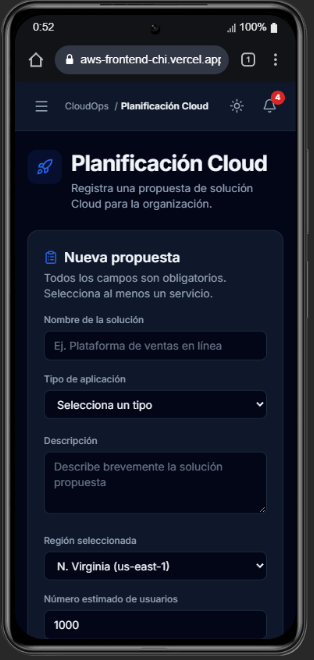
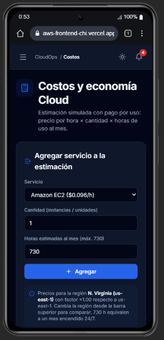
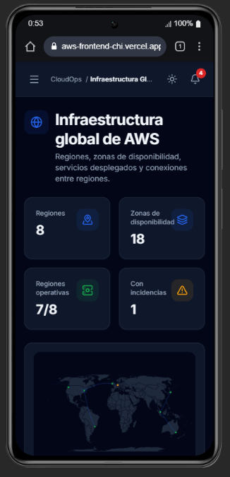
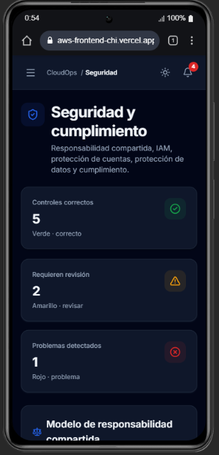
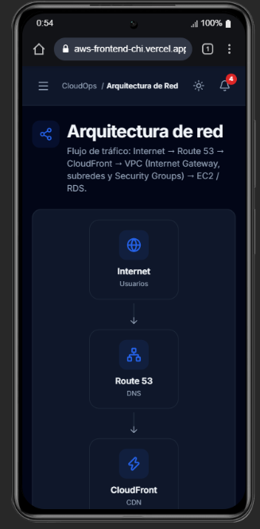
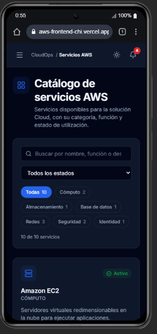

# CloudOps Dashboard

Sistema web para la planificación, visualización y análisis de una solución Cloud en AWS. Práctica integrativa de Cloud Foundations (Semanas 5 y 6).

Es una aplicación **100 % frontend**: no requiere backend ni una cuenta real de AWS. Toda la información (servicios, regiones, costos, seguridad, IAM y arquitectura de red) es simulada con datos mock tipados en TypeScript.

## Tecnologías

- React 19 + TypeScript
- HTML5 y CSS con Tailwind CSS
- Vite
- React Router (navegación y filtros en la URL)
- Lucide React (iconos)
- Recharts (gráficos interactivos)
- react-simple-maps + d3-geo (mapa mundial de regiones)

## Instalación

```bash
npm install
```

## Ejecución

```bash
npm run dev       # servidor de desarrollo (http://localhost:5173)
npm run build     # build de producción (type-check + bundle)
npm run preview   # sirve el build de producción localmente
npm run lint      # análisis estático con oxlint
```

## Funcionalidades

| Módulo | Ruta | Descripción |
|---|---|---|
| Dashboard | `/dashboard` | Servicios utilizados, región seleccionada, costo mensual y anual, estado de seguridad, recursos Cloud, estado de la arquitectura y propuestas. Gráfico de tendencia (3, 6 o 12 meses), gráfico de costo por categoría (clic en una barra para abrir el catálogo filtrado) y resumen de seguridad. Exportación del reporte en CSV e impresión / PDF. |
| Planificación Cloud | `/planning` | Formulario con nombre, tipo de aplicación, descripción, región, usuarios, nivel de disponibilidad, servicios y objetivo de la migración. Cada propuesta se muestra en una tarjeta con todos sus datos y se guarda en `localStorage`. |
| Costos | `/costs` | Estimador por servicio, cantidad y horas de uso al mes: costo estimado por hora, mensual y anual. Los precios se ajustan según la región seleccionada. Gráfico de torta interactivo (mensual / anual) y exportación a CSV. |
| Infraestructura Global | `/infrastructure` | Mapa mundial con regiones, zonas de disponibilidad, servicios desplegados, estado y conexiones. Permite elegir la región principal y simular la caída de una región: el sistema calcula la región operativa más cercana para redirigir el tráfico. |
| Seguridad | `/security` | Modelo de responsabilidad compartida (cliente / AWS / controles compartidos), panel IAM (usuarios, grupos, roles, políticas y MFA) y controles de protección de cuentas, protección de datos y cumplimiento, con semáforo verde / amarillo / rojo y filtro por categoría. |
| Arquitectura de Red | `/network` | Diagrama interactivo (componentes React, no una imagen): Internet → Route 53 → CloudFront → VPC (Internet Gateway, subred pública con Load Balancer, subredes privadas con EC2 y RDS, Security Groups y tablas de rutas). |
| Servicios AWS | `/services` | Catálogo con EC2, S3, RDS, IAM, VPC, Route 53, CloudFront, Lambda, CloudWatch y Shield: nombre, categoría, descripción, función principal y estado. Buscador, filtro por categoría y por estado. |
| Detalle de servicio | `/services/:id` | Vista detallada: características, casos de uso, modelo de precios, costo por hora y mensual, y regiones donde está desplegado. |

### Retos adicionales implementados

- **Modo oscuro**: botón en la barra superior; respeta la preferencia del sistema y se recuerda.
- **Buscador de servicios** y **filtros por categoría** (y por estado) en el catálogo.
- **Gráficos interactivos**: rango de meses, selección de porciones, conmutador mensual / anual y barras clicables.
- **Exportación de reportes**: reporte general en CSV, estimación de costos en CSV e impresión / PDF.
- **Selector de regiones**: la región principal recalcula el Dashboard y los precios.
- **Notificaciones**: centro de notificaciones con alertas de seguridad y de regiones, y avisos emergentes por cada acción.
- **Vista detallada** de cada servicio.
- **Animaciones y transiciones** en tarjetas, páginas, menús y gráficos.
- **Persistencia con `localStorage`**: propuestas, estimación de costos, tema, región y notificaciones.

La interfaz es responsive: en móvil el sidebar se convierte en un menú lateral que también incluye el selector de región.

## Arquitectura

El proyecto sigue **Clean Architecture** con **inyección de dependencias manual** (composition root), de modo que los datos mock se pueden reemplazar por una API real sin tocar componentes ni páginas:

```
src/
├── domain/            # Entidades, constantes de precios e interfaces de repositorio (puertos)
├── application/       # Casos de uso: costos, resumen, failover, alertas, reporte, IAM…
├── infrastructure/    # Adaptadores de los puertos
│   ├── data/            # Datos simulados
│   ├── repositories/    # Implementaciones (mock + localStorage)
│   └── di/              # Composition root (container.ts) + DIProvider
├── presentation/      # UI
│   ├── components/      # common, layout, charts, map, network, security
│   ├── context/         # Tema, región seleccionada y notificaciones
│   ├── hooks/           # Conectan la UI con los casos de uso
│   ├── export/          # Serialización de reportes a CSV
│   ├── pages/
│   └── routes/
└── shared/            # Utilidades puras (formato, CSV, descargas, geolocalización)
```

**Regla de dependencia:** `presentation → application → domain`, con `infrastructure` implementando los puertos de `domain`. Para conectar un backend real, solo se reemplazan las clases de `infrastructure/repositories/` y su registro en `infrastructure/di/container.ts`.

**Componentes reutilizables principales:** `Sidebar`, `Header`, `StatCard`, `ServiceCard`, `CostCard`, `SecurityCard`, `RegionCard`, `StatusBadge`, `PageHeader`, `Panel`, `FilterChips`, `ProposalCard` y `FormField`.

## Capturas

### Dashboard


### Planificación Cloud


### Costos y economía Cloud


### Infraestructura Global


### Seguridad


### Arquitectura de Red


### Servicios AWS

